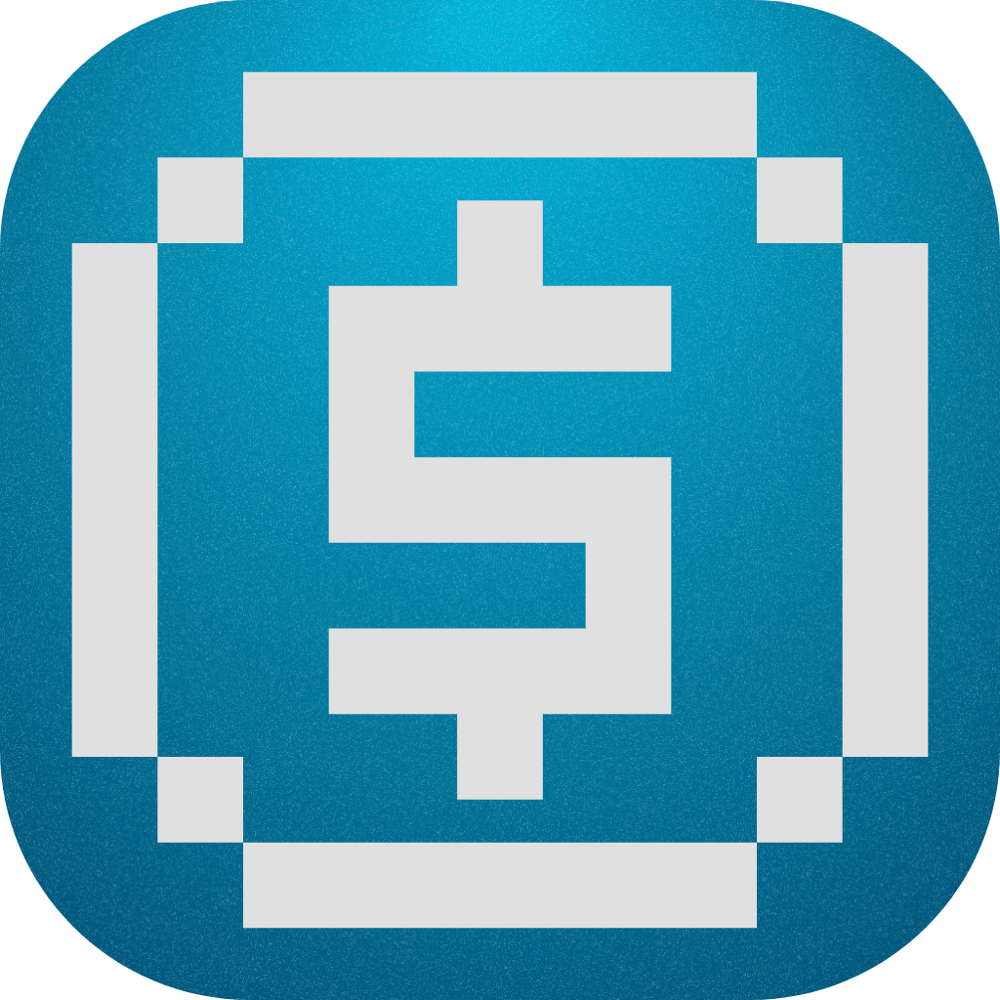

<h1 align="center">Koin</h1>

<p align="center">
  
</p>

<p align="center">
  A self-hosted expense tracker for startups, solo founders, and small agencies. 
  <br>
</p>

<p align="center">
<a href="LICENSE" target="__blank"></a>


</p>

## Features

- **Mercury Bank Sync** — Import via API (real-time) or CSV; auto-categorizes 100+ vendor patterns.
- **Expense Tracking** — Log expenses with receipt attachments and IRS Schedule C category mapping.
- **Mileage Logging** — Track business trips with current IRS standard rates.
- **Contractor Tracker** — Monitor payments and automatically flag 1099-NEC ($600+) thresholds.
- **Recurring Expenses** — Auto-create monthly/quarterly/annual entries for SaaS and subscriptions.
- **Tax Reports** — Generate CPA-ready deduction summaries by category with 1099-NEC prep.
- **IRS Calendar** — Built-in reference for 1099-NEC, W-2, and Form 1040 deadlines.
- **Privacy First** — Self-hosted on your own Cloudflare account. No 3rd party access to your data.
- **Backup & Restore** — Export all data as JSON, import to any instance.

## Tech Stack

- **Framework:** Nuxt
- **UI:** Nuxt UI + Tailwind CSS v4
- **DB:** Cloudflare D1 and R2 for file storage | SQLite via Drizzle ORM for local development
- **Hosting:** Cloudflare Workers (Optional)

## Getting Started

### Local Development

```bash
pnpm install
npx nuxi hub db migrate   # apply migrations to local SQLite
pnpm dev
```

NuxtHub uses a local SQLite file (`.data/db/sqlite.db`) for development — no external database required. The `hub db migrate` step is required on first clone and after any schema changes. To reset your local database, delete `.data/db/sqlite.db` and re-run migrate.

This is the best way to test the full feature set, including Mercury API integration.

### Mercury API Setup

1. Generate a **Read Only** token at [Mercury Settings → API Tokens](https://app.mercury.com/settings/tokens)
2. In Koin, go to **Settings** and paste the token into the Mercury API field
3. Use the **Mercury Import** tab to sync transactions by date range

The token is stored server-side in KV and never sent to the browser in plaintext.

## Deployment

### 1. Configure Cloudflare Resources

Copy the example wrangler config and fill in your own Cloudflare resource IDs:

```bash
cp wrangler.example.jsonc wrangler.jsonc
```

Edit `wrangler.jsonc` with your D1 database ID, R2 bucket name, and KV namespace ID. You can find/create these in the [Cloudflare dashboard](https://dash.cloudflare.com):

- **D1:** Storage & Databases → D1 SQL database → Create Database
- **R2:** Storage & Databases → R2 Object Storage → Create bucket
- **KV:** Storage & Databases → Workers KV → Create Instance

### 2. Deploy to Cloudflare Workers

```bash
pnpm build
npx wrangler deploy
```

### ⚠️ Security

This app has **no built-in authentication**. If deployed to a public URL, **protect it with [Cloudflare Access](https://developers.cloudflare.com/cloudflare-one/applications/configure-apps/)** before sharing:

1. Go to **Zero Trust → Access → Applications** in the Cloudflare dashboard
2. Add your Pages domain and configure an identity provider (Google, GitHub, email OTP)

Without Cloudflare Access, your expense data and bank transactions are publicly readable. For local use only, no additional auth is needed.

## License

MIT — see [LICENSE](LICENSE)
